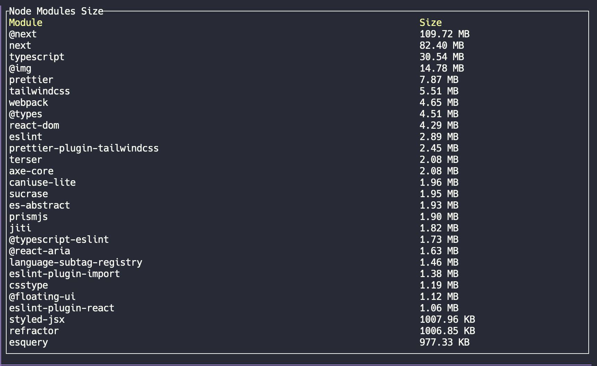

# Node Size Analyzer

A fast CLI tool to analyze and visualize the size of your node_modules dependencies using a terminal UI.



## Features

- Interactive terminal UI using ratatui
- Real-time size calculation of node_modules
- Sorted display by size (largest modules first)
- Human-readable size formatting (B, KB, MB)
- Cross-platform support (Windows, MacOS, Linux)
- Fast directory traversal for quick analysis

## Installation

### Using Cargo

The latest stable version is automatically published to crates.io:

```bash
cargo install node-size-analyzer
```

### From GitHub Releases

Pre-built binaries for all major platforms are automatically generated for each release and available from the [releases page](https://github.com/Caryyon/node-size-analyzer/releases).

#### Linux/MacOS

```bash
# Download the latest release for your platform
curl -L https://github.com/Caryyon/node-size-analyzer/releases/latest/download/node-size-linux -o node-size
# or for macOS: 
# curl -L https://github.com/Caryyon/node-size-analyzer/releases/latest/download/node-size-macos -o node-size
chmod +x node-size
./node-size
```

#### Windows

```bash
# Download using PowerShell
Invoke-WebRequest -Uri https://github.com/Caryyon/node-size-analyzer/releases/latest/download/node-size-windows.exe -OutFile node-size.exe
.\node-size.exe
```

New releases are automatically published when changes are merged to the main branch.

## Usage

1. Navigate to your project directory containing node_modules
2. Run `node-size`
3. The terminal UI will display all modules sorted by size
4. Press 'q' to exit

### Example Output

The tool displays a table with:
- Module names (left column)
- Size in human-readable format (right column)
- Sorted from largest to smallest

## Building from Source

```bash
git clone https://github.com/Caryyon/node-size-analyzer.git
cd node-size-analyzer
cargo build --release
```

The compiled binary will be available at `target/release/node-size`.

## Development

### Project Structure

- `src/main.rs` - Main application code
- `Cargo.toml` - Project dependencies and configuration

### Running Tests

This project includes unit tests for core functionality. To run the tests:

```bash
cargo test
```

The test suite includes:
- Tests for size formatting
- Tests for directory size calculation
- Tests for module scanning and sorting

### Adding Features

When adding new features, please ensure:
1. All tests pass (run `cargo test`)
2. Code follows Rust formatting standards (run `cargo fmt`)
3. No clippy warnings (run `cargo clippy`)

## Contributing

This project uses [Semantic Versioning](https://semver.org/) and [Conventional Commits](https://www.conventionalcommits.org/).

1. Fork the repository
2. Create your feature branch (`git checkout -b feature/amazing-feature`)
3. Add tests for your changes
4. Ensure all tests pass (`cargo test`)
5. Commit your changes using the conventional commit format:
   - `feat: add new feature` (triggers minor version bump)
   - `fix: resolve bug issue` (triggers patch version bump)
   - `docs: update documentation` (triggers patch version bump)
   - `feat!: redesign API` (triggers major version bump)
6. Push to the branch (`git push origin feature/amazing-feature`)
7. Open a Pull Request

See [CONTRIBUTING.md](CONTRIBUTING.md) for detailed guidelines on commit messages and the release process.

## How It Works

The tool:
1. Scans your `node_modules` directory recursively
2. Calculates the size of each top-level module
3. Sorts modules by size (largest first)
4. Renders an interactive table UI with the results

## License

This project is licensed under the MIT License - see the [LICENSE](LICENSE) file for details.

## Acknowledgments

- Built with [ratatui](https://github.com/ratatui-org/ratatui) for the terminal UI
- Terminal handling by [crossterm](https://github.com/crossterm-rs/crossterm)
